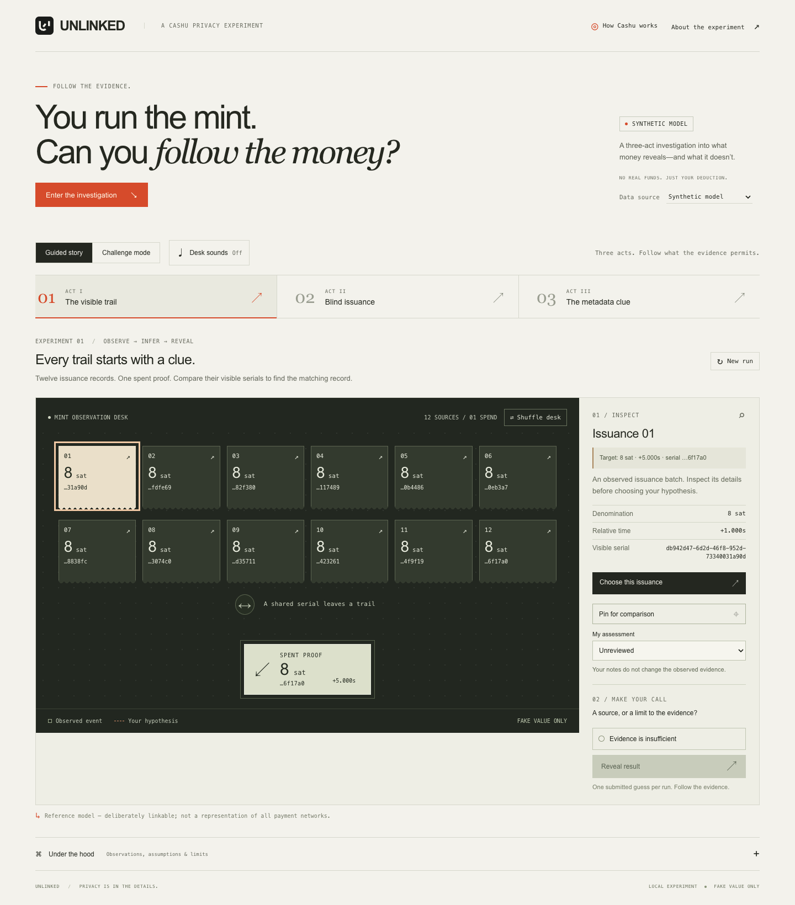
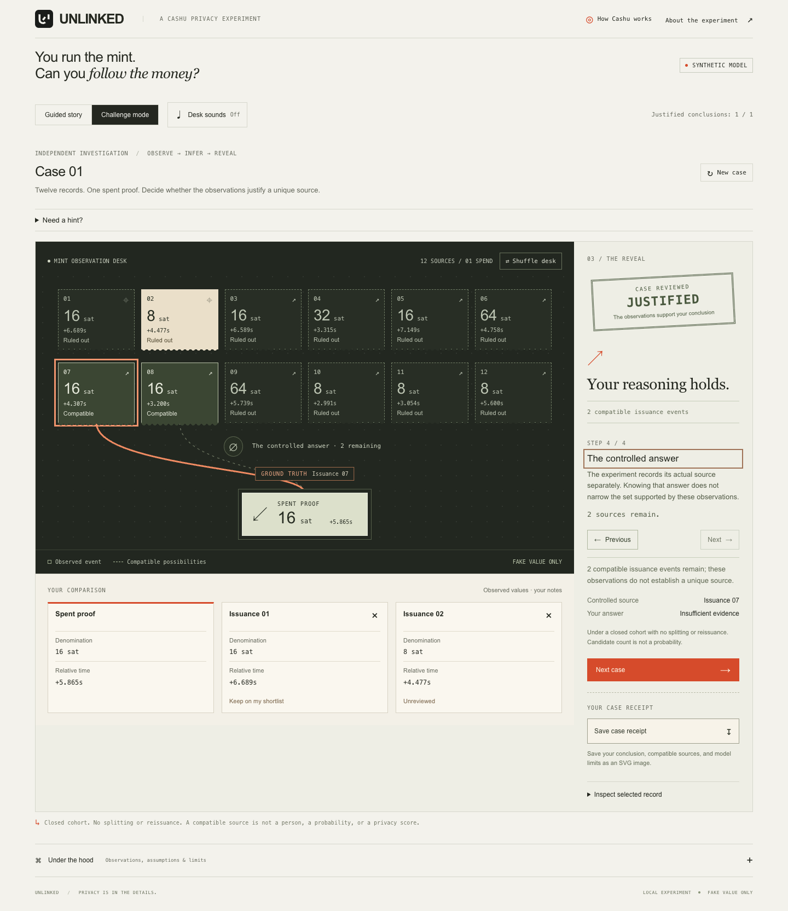
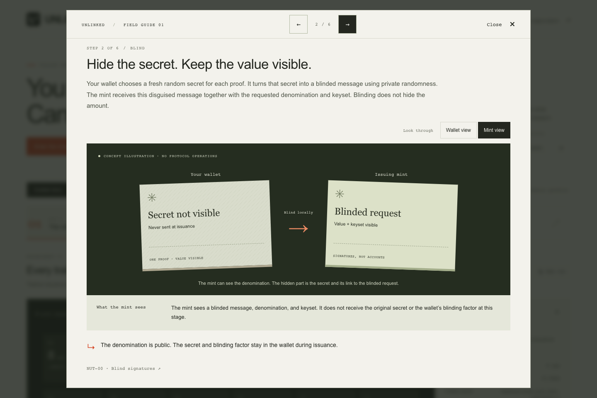
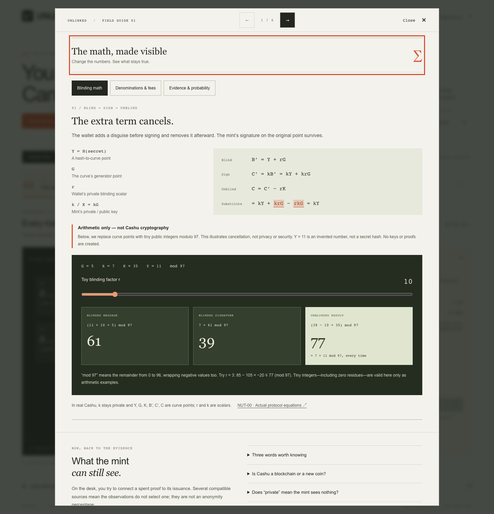
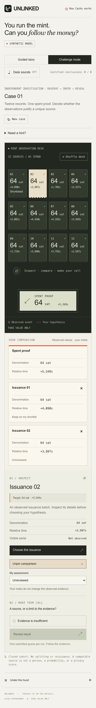

# UNLINKED

**You run the mint. Can you follow the money?**

A playable Cashu privacy investigation. Inspect twelve issuance records, compare them with a spent proof, and decide whether the evidence identifies a source. Then reveal the answer—and see whether your reasoning holds.

[Run locally](#run-locally) · [Screenshots](#screenshots) · [How it works](#how-it-works) · [Upstream projects](#upstream-projects)



## Run locally

Requires **Node 22.16+** and npm.

```sh
git clone https://github.com/brainx/cashu-unlinked.git
cd cashu-unlinked
npm ci --ignore-scripts
npm run dev
```

Open **[127.0.0.1:3210](http://127.0.0.1:3210)**. The app includes its own local server and saved Cashu recordings. No wallet setup or mint process is needed to play.

Use `127.0.0.1` rather than `localhost`; the server checks the Host and Origin headers. `npm run dev` builds and serves the app. Restart it after editing source files. To serve an existing build, run `npm start`; set `PORT=3212` to choose another loopback port.

## What you can do

- **Investigate three acts.** Follow a visible serial, examine blind issuance, then look for a denomination clue.
- **Test your reasoning.** Pin records side by side, keep a shortlist, choose a source or abstain, and step through the reveal. Challenge mode varies the evidence in each new case.
- **Learn Cashu.** Follow six payment steps from wallet and mint perspectives. Explore blinding, denomination arithmetic, input fees, and Bayes’ rule in the math lab.
- **Keep a case receipt.** Download an SVG with your conclusion and the model’s limits. The desk also has a reversible shuffle and optional paper-and-stamp sounds.

Keyboard navigation, reduced motion, and narrow layouts are supported. Notes, guesses, and sound settings stay in page memory and clear on reload. There are no accounts, analytics, third-party trackers, or real funds.

## Screenshots

### Compare the evidence, then reveal the source



The reveal separates what the observations support from the experiment’s known answer. Guessing the right source among several compatible records does not count as a justified conclusion.

### See both sides of a Cashu payment



### Change the numbers and follow the calculation



The math lab labels its small-integer calculation as a teaching example. Real Cashu uses curve points; the example creates no keys or proofs.

<details>
<summary>Mobile investigation</summary>
<br>

</details>

All screenshots show the running application. The investigation images use synthetic cases; the guide and math images are educational illustrations.

## How it works

| Act | Observation | What it demonstrates |
| --- | --- | --- |
| **I · The visible trail** | A shared serial connects issuance and spending. | A deliberately linkable reference model. |
| **II · Blind issuance** | Twelve equal-denomination sources fit the spent proof. | Blind signatures remove the direct serial link. |
| **III · The metadata clue** | One source has the spent proof’s rare denomination. | Metadata can narrow the possibilities. |

The data selector distinguishes **Synthetic model** from **Recorded Cashu run**. Synthetic cases are generated locally. Recordings replay sanitized issuance and recipient-swap captures made with cashu-ts and a local Nutshell FakeWallet mint. Each recording includes versions, keysets, fees, and an integrity digest. Replaying it does not start a mint or generate a new capture.

The question is which **issuance batch** could have produced a spent proof, not which person paid a merchant. The experiment assumes a closed cohort and no splitting or reissuance of the target proof. **Twelve compatible sources is a count, not a probability or privacy score.** Mint custody and surrounding metadata still matter.

## Upstream projects

UNLINKED is an independent educational project built around the work of the Cashu community.

| Project | Role in UNLINKED | Upstream license |
| --- | --- | --- |
| [Cashu NUTs](https://github.com/cashubtc/nuts) | Protocol specifications behind the explainer and recorded evidence format. See [NUT-00](https://cashubtc.github.io/nuts/00/), [NUT-02](https://cashubtc.github.io/nuts/02/), and [NUT-03](https://cashubtc.github.io/nuts/03/). | [MIT](https://github.com/cashubtc/nuts/blob/main/LICENSE) |
| [cashu-ts](https://github.com/cashubtc/cashu-ts) | Wallet SDK used by the capture lab, pinned to **4.10.1**. | [MIT OR Apache-2.0](https://github.com/cashubtc/cashu-ts/blob/v4.10.1/LICENSE.md) |
| [Nutshell](https://github.com/cashubtc/nutshell) | Mint implementation used to record fake-value runs, pinned to **0.20.2** with FakeWallet. | [MIT](https://github.com/cashubtc/nutshell/blob/0.20.2/LICENSE.md) |

Thanks to their maintainers and contributors. Read the [Cashu documentation](https://docs.cashu.space/) for the protocol and ecosystem. This repository implements the investigation and teaching interface; Cashu cryptography comes from the upstream tools. Their licenses apply to their respective projects; UNLINKED does not yet specify its own license.

## Development

React, TypeScript, and Vite render the desk. A loopback Node HTTP server keeps each session’s answer separate from its public evidence. Shared TypeScript modules validate observations and infer compatible sources without consulting that answer.

| Directory | Contents |
| --- | --- |
| `web/` | Investigation desk, Cashu guide, and math lab |
| `src/` | Evidence contracts, validation, inference, and teaching arithmetic |
| `server/` | Local session API and recorded playback |
| `lab/` | Optional fake-value Cashu capture runner |
| `fixtures/recorded/` | Sanitized captures and separately stored controlled answers |
| `tests/` | Core, API, boundary, browser, and lab checks |

```sh
npm test                      # Build and run Node tests
npm run typecheck             # Check core, server, frontend, and lab
npx playwright install chromium
npm run test:browser          # Run browser checks on a temporary local server
```

`npm run verify` runs the software checks together. The optional mint integration is separate; see the [capture lab](lab/README.md). Saved recordings are sufficient for ordinary development and CI.

[Reproduction](docs/REPRODUCIBILITY.md) · [Verification notes](docs/STATUS.md) · [Threat model](docs/THREAT_MODEL.md) · [90-second demo](docs/DEMO_SCRIPT.md)
